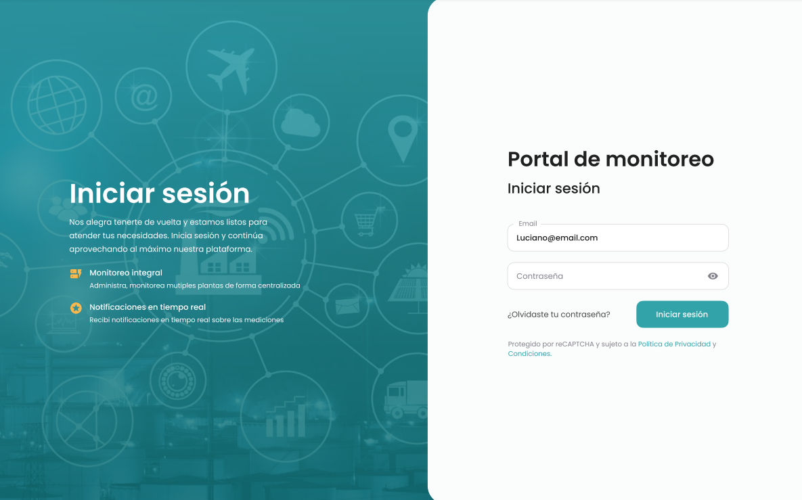
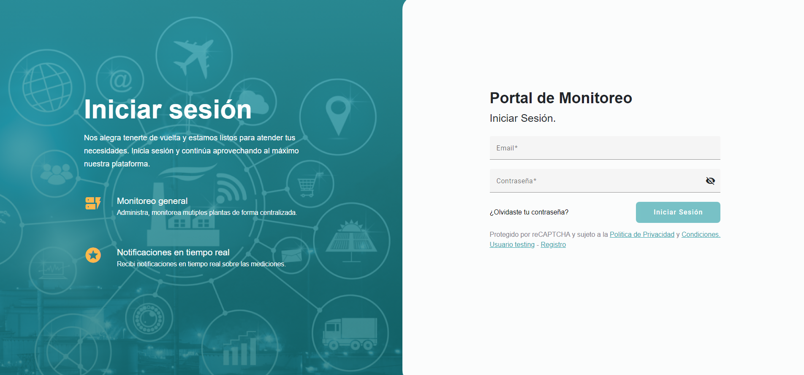
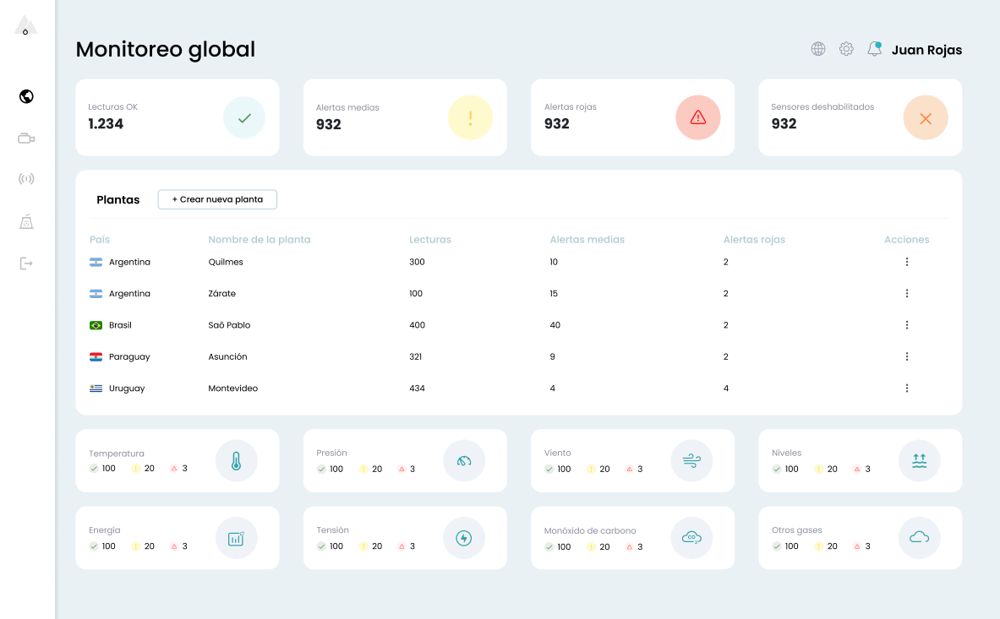
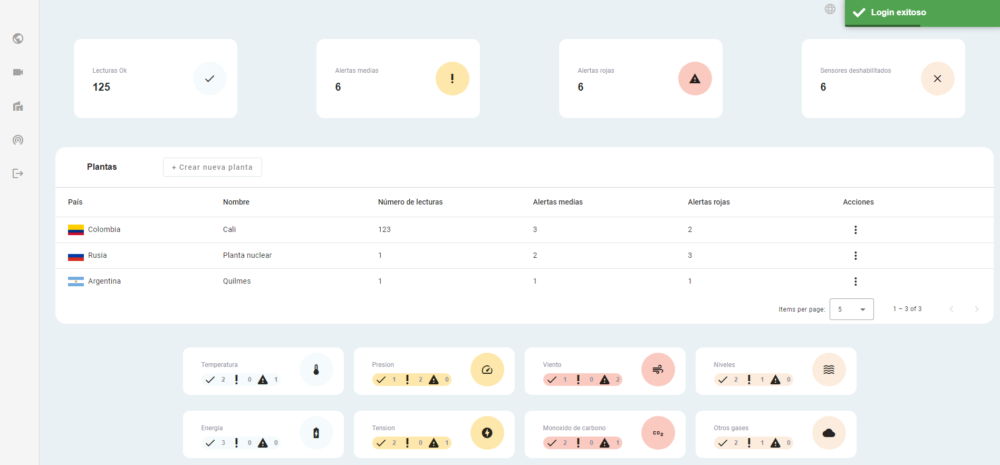
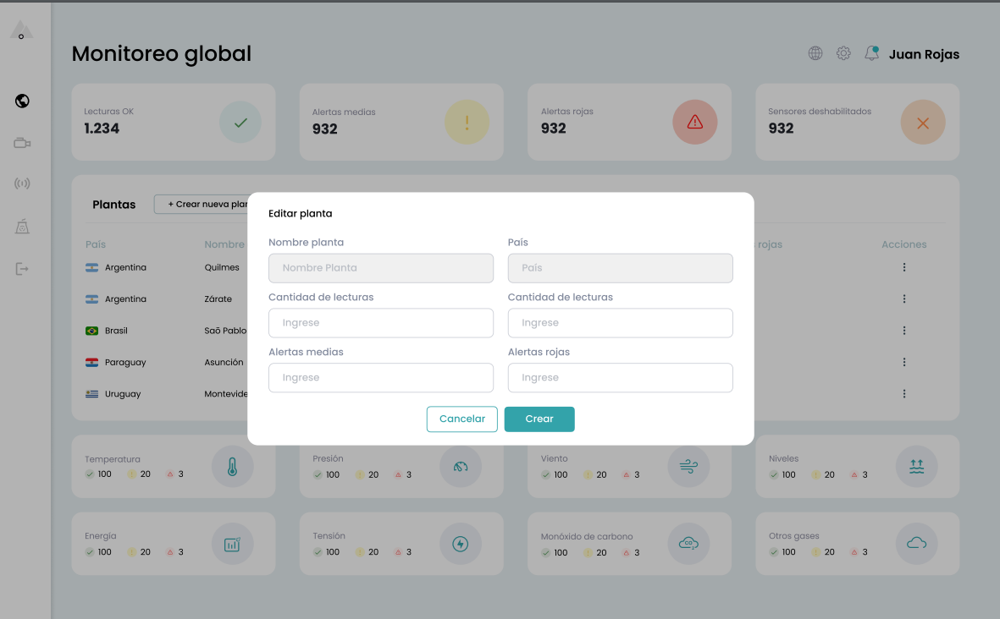
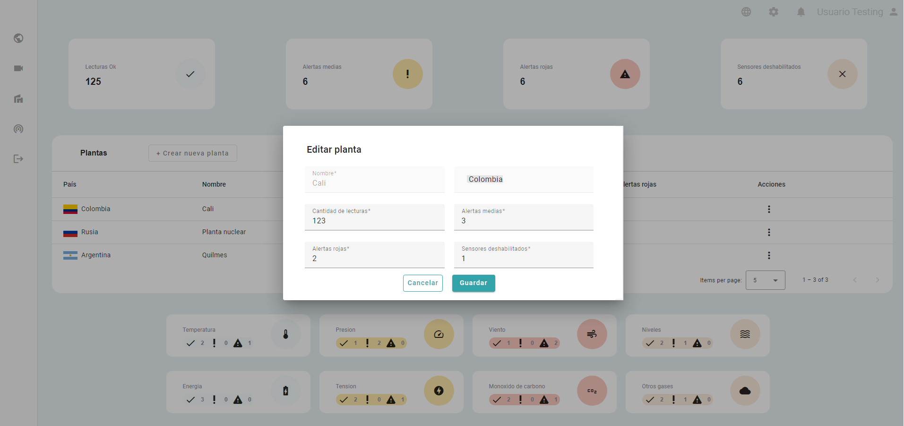

# Challenge Técnico
> [!NOTE]
> Este repositorio contiene la implementación del challenge fullstack para una empresa, incluyendo tanto el desarrollo del frontend como del backend. A continuación, se detalla la arquitectura, funcionalidades, y tecnologías utilizadas en cada parte del proyecto.

## Tecnologías Utilizadas

### Frontend
- **Framework**: Angular
- **Lenguaje**: TypeScript
- **Asincronismo**: Observables para comunicación en tiempo real entre componentes

### Backend
- **Framework**: Java Spring Boot
- **ORM**: Hibernate
- **Autenticación**: JWT (JSON Web Token)
- **Base de Datos**: MySQL (SQL)

### Despliegue
- **Frontend**: Netlify
- **Backend**: Railway

## Funcionalidades

### Frontend

#### Pantallas Implementadas
- **Login**: Formulario de autenticación de usuario con validaciones de email y contraseña.
- **Registro**: Formulario de registro con validaciones de formato y longitud de contraseña.
- **Dashboard**: Pantalla principal para el usuario, con datos dinámicos, filtrado y búsqueda.

#### Funcionalidades Extra
- **Menú de Navegación**: Lateral con enlaces a secciones clave.
- **Navbar del Usuario**: Muestra nombre y avatar del usuario almacenado en LocalStorage.
- **Notificaciones en Tiempo Real**: Para eventos como login y acciones en el dashboard.
- **Multi Layout**: Interfaz adaptada según el rol del usuario.

#### Principales Funcionalidades
- **Autenticación y Seguridad**: Validación y cifrado de contraseñas, control de sesión y guards para proteger rutas.
- **Manejo de Roles**: Autorización basada en roles, limitando el acceso a secciones.
- **Componentes Dinámicos**: Tarjetas y tablas que muestran datos desde el backend, con opciones de orden y filtrado.
- **Responsive Design**: Diseño adaptable a móviles, tablets y escritorio.

### Backend

#### Endpoints y Servicios
- **Autenticación**: Registro e inicio de sesión con validación y cifrado.
- **Gestión de Datos Dinámicos**: Endpoints para lecturas, alertas y sensores.
- **Gestión de Plantas**: Crear, editar y eliminar plantas en la base de datos.
- **Servicios Opcionales**: Configuraciones de perfil y consumo de API externa para obtener países y banderas.

#### Validaciones y Seguridad
- **Autenticación con JWT**: Tokens seguros para sesiones.
- **Control de Acceso**: Restricción de endpoints según roles.
- **Validación de Formulario**: Verificación de contraseñas y emails.
- **Gestión de Errores**: Manejo de excepciones con mensajes claros y amigables para el frontend.

### API RestCountries
La aplicación realiza una integración con la API de **RestCountries** para proporcionar una lista completa de países y sus respectivas banderas

## Configuración y Ejecución

### Frontend
1. Clonar el repositorio:
    ```bash
    git clone https://github.com/asanjinez/techforb-challenge-frontend.git
    ```
2. Instalar dependencias y ejecutar:
    ```bash
    cd frontend
    npm install
    npm start
    ```

### Backend
1. Clonar el repositorio:
    ```bash
    git clone https://github.com/asanjinez/techforb-challenge-backend.git
    ```
2. Instalar dependencias y ejecutar:
    ```bash
    cd backend
    mvn install
    mvn spring-boot:run
    ```

## Enlaces de Repositorios y Demo

- **Repositorio Frontend**: [Enlace al repositorio de frontend](https://github.com/asanjinez/techforb-challenge-frontend)
- **Repositorio Backend**: [Enlace al repositorio de backend](https://github.com/asanjinez/techforb-challenge-backend)
- **Demo en Vivo**: [Enlace a la aplicación desplegada](https://techforb-challenge-asanjinez.netlify.app/)

*Nota*: En la demo en vivo, algunos tiempos de espera pueden ocurrir debido a las limitaciones de versiones gratuitas.

### Comparación entre algunos diseños Figma y la implementación final

| Diseño en Figma                                   | Implementación Final                               |
|--------------------------------------------------|----------------------------------------------------|
|  |  |
|  |  |
|  |  |

---
¡Gracias por revisar este proyecto!
